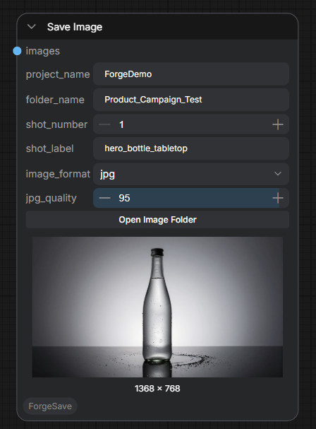
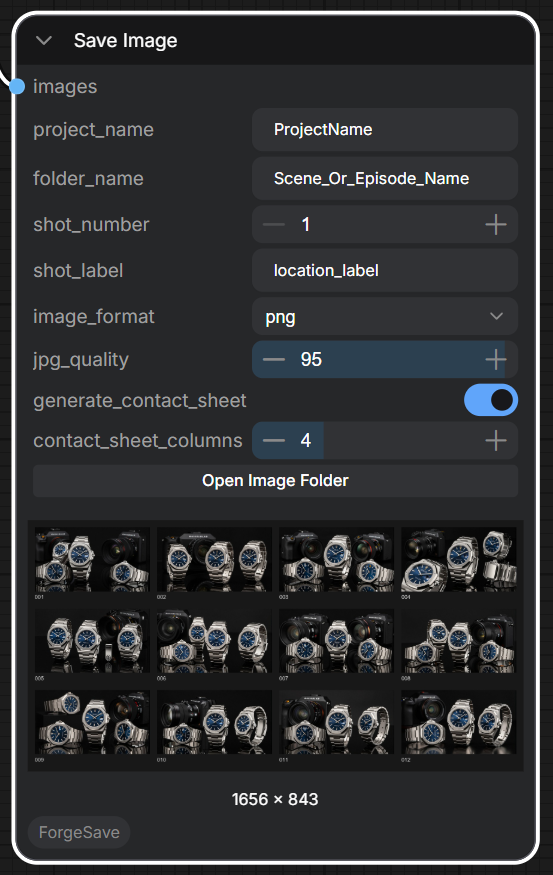
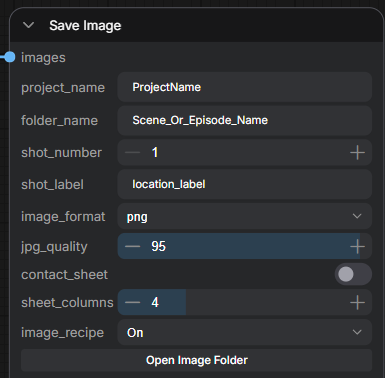
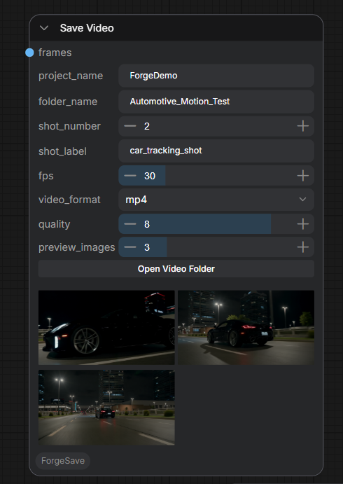

# ComfyUI Forge Save

Production-focused save nodes for ComfyUI featuring structured project folders, automatic versioning, contact sheet generation, image recipe export, preview generation, and production-friendly asset management.

Forge Save helps artists, studios, and teams keep renders organised, reproducible, and easy to review.

---

## Features

* Save Image node
* Save Video node
* Automatic version numbering
* Project-based folder organisation
* Contact sheet generation
* Image Recipe export
* Open output folder buttons
* PNG, JPG and WebP support
* Batch image support
* ComfyUI-native workflow

---

## Image Recipe Export

Forge Save can generate a companion JSON file containing the key information required to help recreate an image.

Enable **Image Recipe** in the Save Image node to automatically save a recipe file alongside each image.

### Stored Information

* Prompt
* Negative Prompt (when available)
* Seed
* Steps
* CFG
* Sampler
* Scheduler
* Denoise
* Model
* CLIP
* VAE
* Width
* Height
* Batch Size

### Example Output

```text
ProjectName/
└── Product_Shoot/
    ├── shot_01_watch_front_v001.png
    └── shot_01_watch_front_v001.json
```

### Why Use Image Recipes?

Image Recipes provide a lightweight way to share generation settings between artists, archive important renders, and help reproduce images without needing to inspect a full ComfyUI workflow.

For complete workflow portability, users can still embed workflow metadata directly into saved images using ComfyUI's native workflow embedding features.

---

## Nodes

Forge Save adds two nodes:

### Save Image

Saves generated images into organised project folders with automatic versioning.

Optional contact sheet generation can be enabled directly on the image save node.

### Save Video

Encodes image frame batches into MP4, WEBM, or GIF files with optional preview images.

Nodes appear under:

```text
Forge Save
```

---

## Screenshots

### Forge Save Image



### Contact Sheet Generation



### Image Recipe Export



Generate lightweight JSON recipe files containing the key settings required to help recreate an image.

### Forge Save Video



---

## Example Output Structure

### Images

```text
ComfyUI/output/
└── Demo_Project/
    └── Product_Shoot/
        ├── shot_01_hero_render_v001.png
        ├── shot_01_hero_render_v002.png
        ├── shot_01_hero_render_v003.png
        └── contact_sheet_shot_01_hero_render_v003.jpg
```

### Videos

```text
ComfyUI/output/
└── Demo_Project/
    └── Product_Shoot/
        ├── shot_01_hero_animation_v001.mp4
        └── _previews/
            ├── preview_shot_01_hero_animation_v001_frame_001.png
            ├── preview_shot_01_hero_animation_v001_frame_002.png
            └── preview_shot_01_hero_animation_v001_frame_003.png
```

---

## Automatic Versioning

Forge Save automatically checks the output directory and increments the version number.

If this file already exists:

```text
shot_01_hero_render_v001.png
```

The next render becomes:

```text
shot_01_hero_render_v002.png
```

Then:

```text
shot_01_hero_render_v003.png
```

This prevents accidental overwriting and keeps render history intact.

---

## Save Image

### Inputs

```text
images
project_name
folder_name
shot_number
shot_label
image_format
jpg_quality
contact_sheet
sheet_columns
image_recipe
```

### Example Settings

```text
project_name: Demo_Project
folder_name: Product_Shoot
shot_number: 1
shot_label: hero_render
image_format: png
jpg_quality: 95
contact_sheet: true
sheet_columns: 4
image_recipe: On
```

### Example Output

```text
ComfyUI/output/Demo_Project/Product_Shoot/shot_01_hero_render_v001.png
ComfyUI/output/Demo_Project/Product_Shoot/contact_sheet_shot_01_hero_render_v001.jpg
ComfyUI/output/Demo_Project/Product_Shoot/shot_01_hero_render_v001.json
```

---

## Contact Sheet Generation

Forge Save Image can automatically generate a contact sheet from the images being saved.

When `contact_sheet` is enabled, Forge Save will:

* Save all generated images normally
* Create a review contact sheet in the same project folder
* Display only the contact sheet in the ComfyUI preview panel
* Keep the original images available on disk

When `contact_sheet` is disabled, Forge Save displays the individual saved images as normal.

This is useful for:

* Client reviews
* Comparing image variations
* Product photography workflows
* Fashion campaign selection
* Batch generation review
* AI art direction and selection

---

## Save Video

### Inputs

```text
frames
project_name
folder_name
shot_number
shot_label
fps
video_format
quality
preview_images
```

### Important

Forge Save Video expects an IMAGE frame batch, not a VIDEO object.

Connect it before your final video combine/output node.

### Example Settings

```text
project_name: Demo_Project
folder_name: Product_Shoot
shot_number: 1
shot_label: hero_animation
fps: 30
video_format: mp4
quality: 8
preview_images: 3
```

### Example Output

```text
ComfyUI/output/Demo_Project/Product_Shoot/shot_01_hero_animation_v001.mp4
```

Preview images:

```text
ComfyUI/output/Demo_Project/Product_Shoot/_previews/
```

---

## Video Quality

The video quality slider ranges from:

```text
1  = Smaller file size
10 = Higher quality
```

Recommended values:

```text
8–10
```

for most production workflows.

---

## Installation

Clone the repository into your ComfyUI `custom_nodes` folder:

```bash
cd ComfyUI\custom_nodes
git clone https://github.com/SRadcliffe/ComfyUI-Forge-Save.git
```

Restart ComfyUI.

---

## Requirements

```text
numpy
pillow
imageio
imageio-ffmpeg
```

Install manually if required:

```bash
pip install -r requirements.txt
```

Depending on your ComfyUI setup, some of these may already be installed.

---

## Repository Structure

```text
ComfyUI-ForgeSave/
├── __init__.py
├── README.md
├── LICENSE
├── requirements.txt
├── assets/
│   ├── forge-save-image-node.png
│   ├── forge-save-contact-sheet.png
│   ├── forge-save-image-recipe.png
│   └── forge-save-video-node.png
├── nodes/
│   ├── forge_save_image.py
│   └── forge_save_video.py
└── web/
    └── forge_save.js
```

---

## Open Folder Buttons

Both nodes include quick-access buttons:

```text
Open Image Folder
Open Video Folder
```

These automatically open the relevant output directory on the machine running ComfyUI.

---

## Typical Use Cases

* AI image generation
* AI video production
* Product visualisation
* Automotive workflows
* Architectural visualisation
* Batch rendering
* Client projects
* Shot-based production pipelines
* Version-controlled render output
* Contact sheet review workflows

---

## Roadmap

Planned additions:

* Render manifest export
* Project presets
* Review video generation
* Metadata browser
* Wider ForgeFlow production toolkit modules

---

## Support

If Forge Save helps your workflow, support future development:

https://buymeacoffee.com/sradcliffe

---

## License

MIT License

---

## Author

Created by ForgeWorks Studio

Simon Radcliffe
